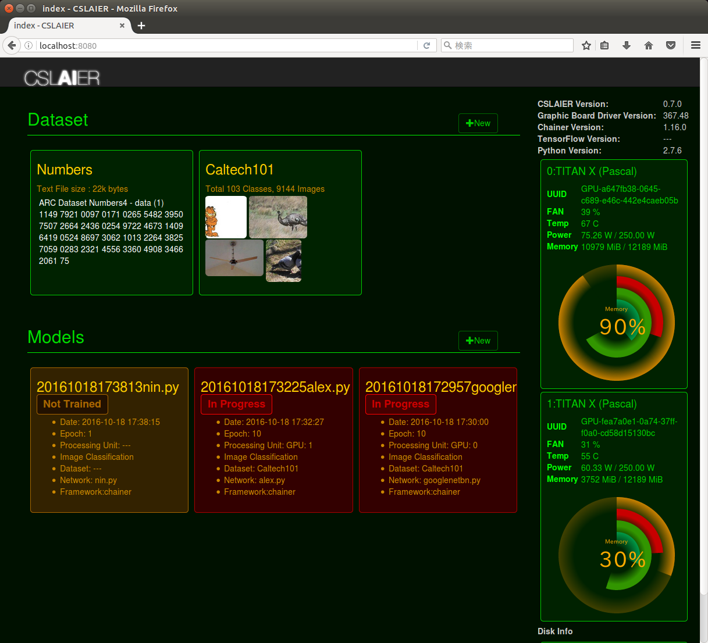
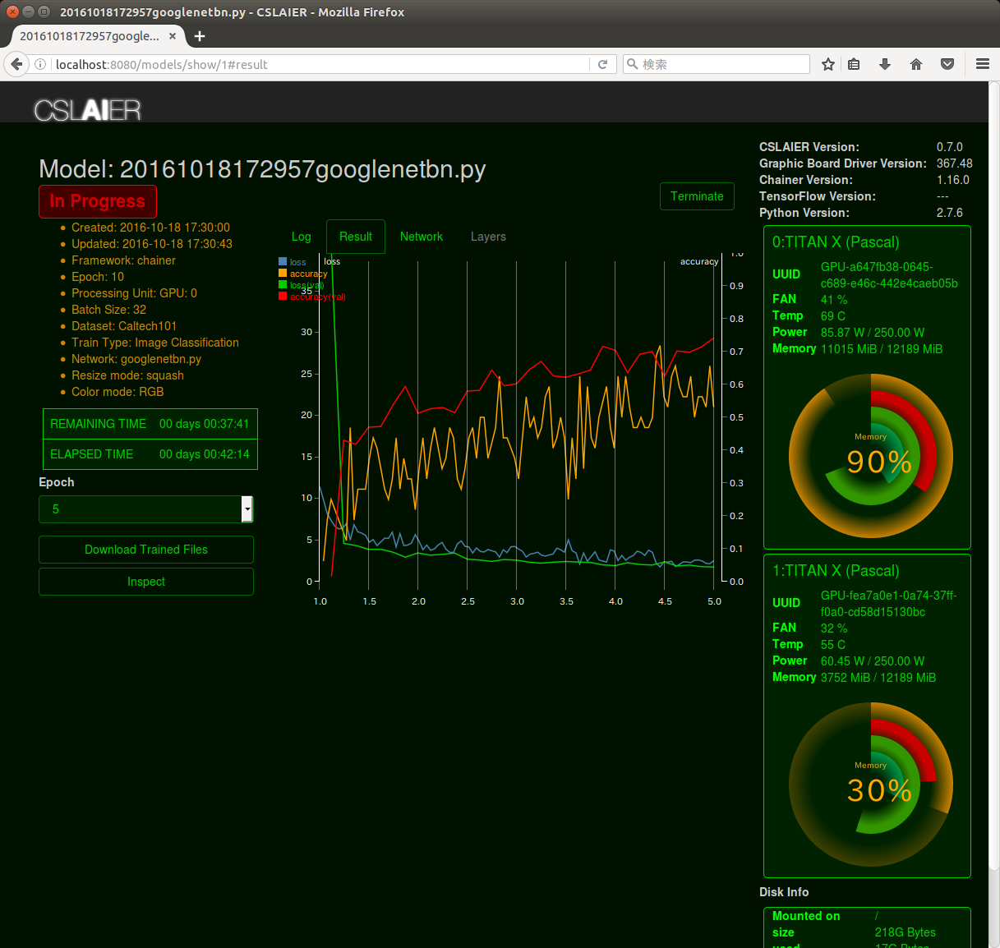
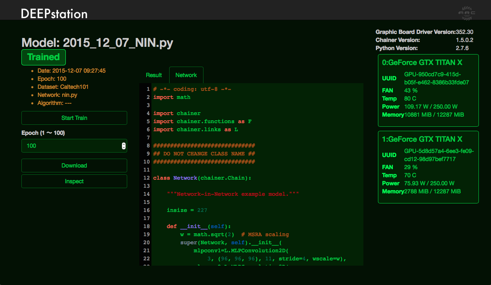
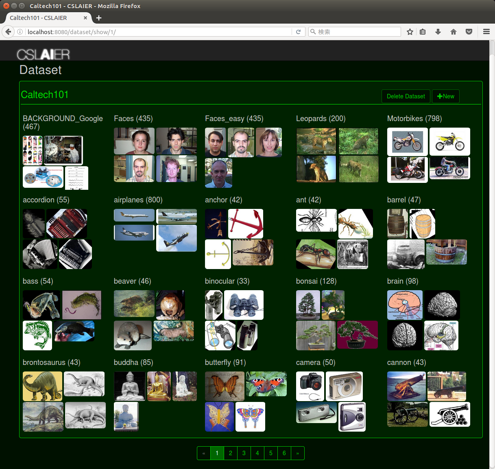

CSLAIER
============

CSLAIER version 0.7.0

Browser based GUI deep learning tool.

Screenshots
-------------

### Top page


### Model detail page
#### Train result


#### View and Edit model


### Dataset page


Requirement
------------

CSLAIER is tested on Ubuntu 14.04. We recommend them to use CSLAIER, though it may run on other systems as well.

### Supported Browsers

* Chrome
* Safari
* Firefox

### System

Minimum requirment:

* Python 2.7
* opencv
* hdf5
* SQLite3
* nkf
* matplotlib
* Other dependenceis, see [requirements.txt](./requirements.txt)

Requirements for some features:

* NVIDIA CUDA Technology GPU and drivers / CUDA 7.5
* TensorFlow 0.9.0 or higher https://www.tensorflow.org/


Setup
------

### Config

* Edit `cslaier.cfg` to set paths for saving files.
  * Begin with `/` stands for abosolute path.
  * Begin without `/` or begin with `./` stands for absolute path from CSLAIER's root directory.
  * Parameters are below

|Parameter|Description|
|---|---|
|HOST|name or IP address of your host|
|PORT|Port number|
|DEBUG|Debug flag (True or False)|
|UPLOADED_FILE|Path for uploaded files will save.|
|UPLOADED_RAW_FILE|Path for uploaded zip files will save.|
|INSPECTION_TEMP|Path for uploaded images for inspection will save.|
|PREPARED_DATA|Path for preprocessed data for train will save.|
|TRAINED_DATA|Path for trained data will save.|
|DATABASE_PATH|Path of cslaier.db|
|LOG_DIR|Path for log file|


### Install dependenceis

* CSLAIER requires these libralies. Install these first.
  * opencv
  * hdf5
  * matplotlib

#### Mac

Use Homebrew to intall like instructions below.

```sh
$ brew tap homebrew/science
$ brew tap homebrew/python
$ brew install opencv hdf5 nkf
$ brew install matplotlib
```

#### Ubuntu

On Linux system, use package manager to install.
Instructions below is an example on Ubuntu14.04.

```sh
$ sudo apt-get install python-pip
$ sudo apt-get install python-dev
$ sudo apt-get install libhdf5-dev
$ sudo apt-get install python-opencv
$ sudo apt-get install sqlite3
$ sudo apt-get install python-matplotlib
$ sudo apt-get install nkf
```

### Starting up server first time

* Try command below on root directory of CSLAIER.

```sh
$ ./setup.sh # setting up database
$ pip install -r requirements.txt # install python dependenceis
$ ./run.sh # run server
```

* Access `http://localhost:8080` on your browser.
If you have changed hostname and port on `cslaier.cfg`, use that one.

### How to update

* Make backup `cslaier.cfg` and `cslaier.db`.
* Get newest code by `git pull` or something.
* Restore `cslaier.cfg` and `cslaier.db` from backup.
* Follow the instructions below as required.

Usage
------

### Start up CSLAIER
* Move to CSLAIER's directory.
* Run
` $ ./run.sh`.
* Access `http://localhost:8080` by web browser.

### Creating Dataset
* Upload dataset from '+new' button on Dataset section on top page.
* Dataset is a zip file which contains classifeid images by directory like [Caltech 101](http://www.vision.caltech.edu/Image_Datasets/Caltech101/) dataset.

### Creating Model
* Make model from '+new' button on Models section on top page.
* Select network template from list.
* Edit it, if you want.
* Press 'Create' button. Then model is created and move to model detail page.

### Start Train
* Select created Model from top page.
* Press 'start train' button.
  * Fill in forms and start train.

### Inspection

* Move to 'Model' page.
* Chose 'Epoch' which you want to use for inspection.
* Press 'inspect' button.
* Select image(.jpg) for inspection.
* Press 'Submit'. Then you will see the result of inspection.

Known issues
------------

* Train result graph's epoch is not correctly shown.


Tips
-----

License
--------

* MIT License


CSLAIER
============

ブラウザベースのGUI深層学習ツール

Requirement
------------

CSLAIERはUbuntu14.04でテストしています。

### Supported Browsers

* Chrome
* Safari
* Firefox

### System

Minimum requirment:

* Python 2.7
* opencv
* hdf5
* SQLite3
* nkf
* matplotlib
* その他の依存ライブラリについては [requirements.txt](./requirements.txt) をご参照ください。

Requirements for some features:

* NVIDIA CUDA Technology GPU and drivers / CUDA 7.5
* TensorFlow 0.9.0 or higher https://www.tensorflow.org/

#### LSTMで分かち書きを利用したい場合

* 下記を`apt-get`などでインストールする
  * mecab
  * libmecab-dev
  * mecab-ipadic
  * mecab-ipadic-utf8
  * python-mecab

Setup
------

### Config

* 各種ファイルの保存場所を`cslaier.cfg`に定義します。
  * `/` で始まるパスは絶対パスとして処理されます。
  * `/` で始まらないパス、`./`で始まるパスはCSLAIERのルートディレクトリ直下の相対パスとして処理されます。
  * 設定ファイルのパラメタの意味は下記の通りです

|パラメタ|説明|
|---|---|
|HOST|ホスト名|
|PORT|ポート番号|
|DEBUG|デバグフラグ|
|UPLOADED_FILE|アップロードされたデータ・セットの格納場所|
|UPLOADED_RAW_FILE|アップロードされたzipファイルの格納場所|
|INSPECTION_TEMP|inspection用の画像のアップロード先|
|PREPARED_DATA|学習用の前処理済データの格納場所|
|TRAINED_DATA|学習済データの格納場所|
|DATABASE_PATH|cslaier.dbの場所|
|LOG_DIR|ログファイルの出力場所|

### 依存ライブラリのインストール

* 下記のライブラリをインストールする必要があります。
  * opencv
  * hdf5
  * matplotlib

#### Macの場合

Homebrewなどを使ってインストールしてください。下記は一例です。

```sh
$ brew tap homebrew/science
$ brew tap homebrew/python
$ brew install opencv hdf5 nkf
$ brew install matplotlib
```

#### Ubuntuの場合

Linuxの場合はパッケージマネージャーを利用してインストールしてください。
下記はUbuntu14.04の例です。

```sh
$ sudo apt-get install python-pip
$ sudo apt-get install python-dev
$ sudo apt-get install libhdf5-dev
$ sudo apt-get install python-opencv
$ sudo apt-get install sqlite3
$ sudo apt-get install python-matplotlib
$ sudo apt-get install nkf
```

### 初回起動

* 下記のコマンドを実行する

```sh
$ ./setup.sh # setting up database
$ pip install -r requirements.txt # install python dependenceis
$ ./run.sh # run server
```

* ブラウザで `http://localhost:8080` にアクセスします。
`cslaier.cfg`でhostnameとportを変更している場合はそちらを利用してください。

### Update時の注意点

* `cslaier.cfg`(旧`settings.yaml`)と`cslaier.db`のバックアップをとってください。
* `git pull`などで新しいソースコードを取得します。
* `cslaier.cfg`と`cslaier.db`をバックアップから復元します。
* 必要に応じて、以下のアップデート手順を実行します。


使い方
------

### 学習の手順
1. Datasetの作成
2. Modelの作成
3. Modelの学習
4. Modelによる画像の予測結果の取得

### CSLAIERの起動
* CSLAIERをcloneしてきた場所に移動
* `./run.sh` を実行
* ブラウザで`http://localhost:8080` にアクセスする

### Datasetの作成
* ディレクトリ毎にカテゴリ分けされた画像セットを用意し、zip形式に格納します。
  * ディレクトリは[Caltech 101](http://www.vision.caltech.edu/Image_Datasets/Caltech101/)のような構造になっている必要があります。
  * サブディレクトリ名が画像の予測結果の分類カテゴリーの名前になります。
* トップページのDatasetセクションにある'+new'ボタンを押し、Dataset Nameに任意のDataset名を記入します。
*　'ファイルを選択'ボタンで作成した画像セットをアップロードします。
* トップページのDatasetセクションにアップロードしたDatasetが追加されていれば、無事Datasetの作成は完了です。

### Modelの作成
* トップページのModelsセクションにある'+new'ボタンを押し、Model新規作成画面に移動します。
* Choose Network Template下のセレクトボックスで、任意のネットワークテンプレートを選択します。
  * 必要であればModel名やNetwork名を変更します。
  * 中央に表示されるエディタでModelの編集が可能です。編集しないでも動作します。
* 下段の'Create'ボタンを押すとModelが作成され、Modelの詳細画面に遷移します。
  * 左上に表示されている'CSLAIER'ロゴを押すと、トップページに遷移します。
* トップページのModelsセクションに作成したModelが追加されていれば、無事Modelの作成は完了です。

### 作成したModelからの学習
* トップページのModelsセクションから学習に利用するModelを選択し、Modelの詳細画面に移動します。
* 'start train'ボタンを押し、使用するDataset、学習させるEpock(世代)の数、使用するGPUのIDを選択します。
* 'Start'ボタンで学習が開始され、Modelのステータスが'In Progress'に切り替わります。
* Modelのステータスが`In Progress'から'Trained'に切り替われば、無事Modelの学習は完了です。
  * 注:使用するDataset、学習させるEpoch(世代)の数、使用するGPUの種類と数によって学習にかかる時間は大きく変化します。

### 学習済Modelによる画像の予測(inspection)
* トップページのModelsセクションから学習済みModel('Trained'となっているModel)を選択し、Modelの詳細画面に移動します。
* Epock下の入力ボックスで予測に利用するEpoch(世代)を指定します。
* 'inspect'ボタンを押します。
* 予測させたい画像を選択します。
* 'Submit'ボタンを押すと、予測結果が表示されます。

Tips
-----

### Datasetの編集について
####　画像の追加と削除
* トップページのDatasetセクションから編集するDatasetを選択して、Datasetの詳細画面に移動します。
* Datasetの詳細画面内で編集するカテゴリー選択して、カテゴリーの詳細画面に移動します。
* **画像を追加する場合:** カテゴリーの詳細画面内の'+New'ボタンを押し、'ファイルを選択'ボタンで追加したい画像をアップロードします。
* **画像を削除する場合:** カテゴリーの詳細画面内にある削除する画像をクリックして、'OK'ボタンを押します。

####　カテゴリーの追加と削除
* トップページのDatasetセクションから編集するDatasetを選択して、Datasetの詳細画面に移動します。
* **カテゴリーを追加する場合:** Datasetの詳細画面内の'+New'ボタンを押し、カテゴリー名を指定してカテゴリーを作成します。
* **カテゴリーを削除する場合:** 削除するカテゴリー選択して、カテゴリーの詳細画面に移動します。'Delete Category'ボタンを押して、'OK'ボタンを押します。

####　Datasetの削除
* トップページのDatasetセクションから編集するDatasetを選択して、Datasetの詳細画面に移動します。
* 'Delete Dataset'ボタンを押して、'OK'ボタンを押します。

####　Datasetのディレクトリを直接編集する
* Datasetのディレクトリの中身は直接編集することが可能です。ただしディレクトリ自体のパスは変更しないでください。

### Modelの編集について
####　Modelの編集
* トップページのModelsセクションから編集したいModelを選択し、Modelの詳細画面に移動します。
* 'Network'タブを押し、表示されるエディタからModelを編集します。
* 'Create'ボタンを押して、Model名やNetwork名を指定し、編集を終了します。
   * 注:編集したModelは別のModelとして新規作成されます。

####　Modelの削除
 * トップページのModelsセクションから削除したいModelを選択し、Modelの詳細画面に移動します。
 * 'Delete'ボタンを押すと選択されたModelが削除されます。
   * 注: 学習済のモデルも一緒に削除されます。

### 経過グラフについて
Modelの詳細画面内の'Result'タブを押すと学習の経過グラフが表示され、学習の経過を確認することができます。
学習中のModel('In Progress'となっているModel)の場合は経過グラフが随時更新されていきます。

#### 経過グラフの各線分

|名前|線分の色|意味|
|---|---|---|
|loss|青|誤差|
|accuracy|オレンジ|正確性|
|loss(val)|緑|学習中の誤差 |
|accuracy(val)|赤|学習中の正確性|

横軸はEpoch数です。

### 学習が完了したModelの利用
Modelの詳細画面内の'Download Trained Files'ボタンを押下すると、学習済みModel、Label(カテゴリの一覧)、Mean File、ネットワークファイルをzip圧縮されたものをダウンロードすることができます。
他のプログラムからの利用方法は[サンプル](./examples/inspection/)を参照ください。

### cslaier.cfg の編集について

#### 各種ファイルの保存場所を変更する
* cslaier.cfgを編集し、保存場所のパスを変更します。
* サーバーを再起動します。

#### 外部のマシーンからアクセスする
* cslaier.cfgを編集し、ホストとポートを指定します。
* サーバーを再起動します。
* CSLAIERが動いている以外のマシンでブラウザより、cslaier.cfgに指定したURLにアクセスし、CSLAIERの画面が開いたら成功です。

#### Dockerの利用

* Ubuntu14.04、GPU無しでchainerとtensorflowを利用するDockerfileが用意されています。利用するときは`docker build`する必要があります。
* dockerを利用する場合、cslaier.cfgは `docker_config/cslaier.cfg`を利用してください。ただし、`HOST='0.0.0.0'`はそのままにしておく必要があります。

##### Dockerイメージのビルド

末尾の`.`を忘れないように

```
$ cd (cslaierのルート・ディレクトリ)
$ docker build -t cslaier/ubuntu14_cpu_ds .
```

##### CSLAIER用Dockerイメージの起動

```
$ docker run -d -p 8080:8080 cslaier/ubuntu14_cpu_ds
```

上記コマンド実行後、ブラウザで `http://localhost:8080` にアクセスする

##### CSLAIER用Dockerイメージの終了

```
$ docker ps
CONTAINER ID        IMAGE                               COMMAND                  CREATED             STATUS              PORTS                     NAMES
7803235d494c        cslaier/ubuntu14_cpu            "/bin/sh -c 'sh -c 'l"   5 seconds ago       Up 3 seconds        0.0.0.0:32769->8080/tcp   desperate_hawking
# docker ps 出力のCONTAINER IDを指定する
$ docker stop 7803235d494c
```

既知の不具合
----------

* TensorFlowを用いて学習した場合、学習結果のグラフに表示されるepoch数が指定したepochの半分くらいの値になります。


License
--------

* MIT License
