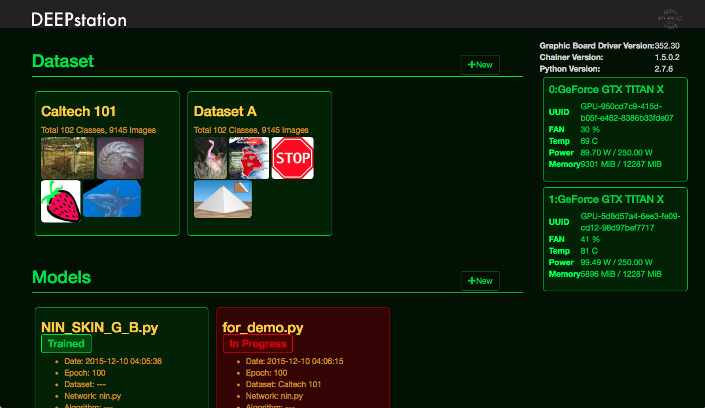
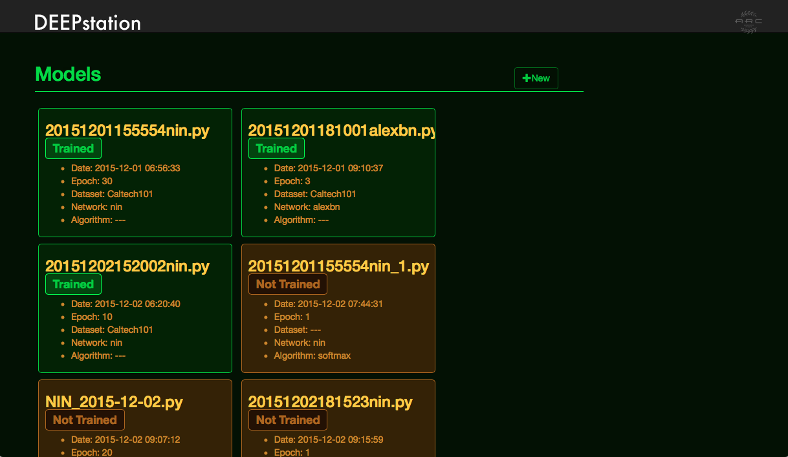

DEEPstation
============

DEEPstation version 0.6.0

Browser based GUI deep learning tool.

Screenshots
-------------

### Top page
#### Datasets

#### Modes

### Model detail page
#### Train result

#### View and Edit model

### Dataset page

Requirement
------------

DEEPstation is tested on Ubuntu 14.04. We recommend them to use DEEPstation, though it may run on other systems as well.

### Supported Browsers

* Chrome
* Safari
* Firefox

### System
* NVIDIA CUDA Technology GPU and drivers
* Python 2.7
  * python-opencv
  * python-scipy
* SQLite3
* nkf

### Python Libraries
* Chainer 1.5 or higher http://chainer.org
* Flask
* Flask-SQLAlchemy
* cv2
* matplotlib
* python-nkf

Setup
------

* Edit `deepstation.cfg` to set paths for saving files.
  * Begin with `/` stands for abosolute path.
  * Begin without `/` or begin with `./` stands for absolute path from DEEPstation's root directory.
  * Parameters are below

|Parameter|Description|
|---|---|
|HOST|name or IP address of your host|
|PORT|Port number|
|DEBUG|Debug flag (True or False)|
|UPLOADED_FILE|Path for uploaded files will save.|
|UPLOADED_RAW_FILE|Path for uploaded zip files will save.|
|INSPECTION_TEMP|Path for uploaded images for inspection will save.|
|PREPARED_DATA|Path for preprocessed data for train will save.|
|TRAINED_DATA|Path for trained data will save.|
||Path of nvidia-smi command|
|DATABASE_PATH|Path of deepstation.db|
|LOG_DIR|Path for log file|

* Setup database. Try command below on root directory of DEEPstation.
`./setup.sh`
* Startup server. `./run.sh`
* Access `http://localhost:8080` on your browser.
If you have changed hostname and port on `deepstation.cfg`, use that one.

### How to update

* Make backup `deepstation.cfg` and `deepstation.db`.
* Get newest code by `git pull` or something.
* Restore `deepstation.cfg` and `deepstation.db` from backup.
* Follow the instructions below as required.

#### Migration v0.2.1 to v0.3.0

* Stop DEEPstation by `ctrl + c`
* Run command below on root directory of DEEPstation
`sqlite3 deepstation.db < ./scheme/migration_20160208.sql`
* Start DEEPstation.

#### Migration v0.3.0 to v0.4.0

* Stop DEEPstation by `ctrl + c`
* Run command below on root directory of DEEPstation
`sqlite3 deepstation.db < ./scheme/migration_20160209.sql`
* Start DEEPstation.

#### Migration v0.4.x to v0.5.0

* Stop DEEPstation by `ctrl + c`
* Install `nkf` if you don't have yet.
* Install `python-nkf`. Using `pip intall nkf` is easy.
* Run command below on root directory of DEEPstation
`sqlite3 deepstation.db < ./scheme/migration_20160314.sql`
* Start DEEPstation.

#### Migration v0.5.x to v0.6.0

In v0.6.0, we use Flask instead of bottle. So, we have changed **setting file** and **how to run**.

* Changes of setting files
  * Setting file has changed `settings.yaml` to `deepstation.cfg`.
* Update deepstation.db
  * `sqlite3 deepstation.db < ./scheme/migration_20160314.sql`
* Run DEEPstation
 * `./run.sh`

Usage
------

### Start up DEEPstation
* Move to DEEPstation's directory.
* Run `./run.sh`.
* Access `http://localhost:8080` by web browser.

### Creating Dataset
* Upload dataset from '+new' button on Dataset section on top page.
* Dataset is a zip file which contains classifeid images by directory like [Caltech 101](http://www.vision.caltech.edu/Image_Datasets/Caltech101/) dataset.

### Creating Model
* Make model from '+new' button on Models section on top page.
* Select network template from list.
* Edit it, if you want.
* Press 'Create' button. Then model is created and move to model detail page.

### Start Train
* Select created Model from top page.
* Press 'start train' button.
  * Fill in forms and start train.

### Inspection

* Move to 'Model' page.
* Chose 'Epoch' which you want to use for inspection.
* Press 'inspect' button.
* Select image(.jpg) for inspection.
* Press 'Submit'. Then you will see the result of inspection.

Tips
-----

License
--------

* MIT License

DEEPstation
============

ブラウザベースのGUI深層学習ツール

Requirement
------------

DEEPstationはUbuntu14.04でテストしています。 Ubuntu上で動かすことをおすすめしますが、他のプラットフォームでも動作します。

### Supported Browsers

* Chrome
* Safari
* Firefox

### System
* NVIDIA CUDA Technology GPU and drivers
* Python 2.7
  * python-opencv
  * python-scipy
* SQLite3
* nkf

### Python Libraries
* Chainer 1.5 or higher http://chainer.org
* Flask
* Flask-SQLAlchemy
* cv2
* matplotlib
* python-nkf

### LSTMで分かち書きを利用したい場合

* 下記を`apt-get`などでインストールする
  * mecab
  * libmecab-dev
  * mecab-ipadic
  * mecab-ipadic-utf8
  * python-mecab

Setup
------

* 各種ファイルの保存場所を`deepstation.cfg`に定義します。
  * `/` で始まるパスは絶対パスとして処理されます。
  * `/` で始まらないパス、`./`で始まるパスはDEEPstationのルートディレクトリ直下の相対パスとして処理されます。
  * 設定ファイルのパラメタの意味は下記の通りです

|パラメタ|説明|
|---|---|
|HOST|ホスト名|
|PORT|ポート番号|
|DEBUG|デバグフラグ|
|UPLOADED_FILE|アップロードされたデータ・セットの格納場所|
|UPLOADED_RAW_FILE|アップロードされたzipファイルの格納場所|
|INSPECTION_TEMP|inspection用の画像のアップロード先|
|PREPARED_DATA|学習用の前処理済データの格納場所|
|TRAINED_DATA|学習済データの格納場所|
||nvidia_smiコマンドのパス|
|DATABASE_PATH|deepstation.dbの場所|
|LOG_DIR|ログファイルの出力場所|

* `./setup.sh` を実行します
* サーバを起動します。DEEPstationをダウンロードしたディレクトリで `./run.sh`を実行します
* ブラウザで `http://localhost:8080` にアクセスします。
`deepstation.cfg`でhostnameとportを変更している場合はそちらを利用してください。

### Update時の注意点

* `deepstation.cfg`(旧`settings.yaml`)と`deepstation.db`のバックアップをとってください。
* `git pull`などで新しいソースコードを取得します。
* `deepstation.cfg`と`deepstation.db`をバックアップから復元します。
* 必要に応じて、以下のアップデート手順を実行します。

#### v0.2.1 から v0.3.0 へのアップデート方法

* DEEPstationを止めてください。DEEPstation実行中のターミナルで`ctrl + c`で止まります。
* DEEPstationのルートディレクトリで下記のコマンドを実行してください。
`sqlite3 deepstation.db < ./scheme/migration_20160208.sql`
* DEEPstationを起動してください。

#### v0.3.0 から v 0.4.0 へのアップデート方法

* DEEPstationを止めてください。DEEPstation実行中のターミナルで`ctrl + c`で止まります。
* DEEPstationのルートディレクトリで下記のコマンドを実行してください。
`sqlite3 deepstation.db < ./scheme/migration_20160209.sql`
* DEEPstationを起動してください。

#### v0.4.x から v 0.5.0 へのアップデート方法

* DEEPstationを止めてください。DEEPstation実行中のターミナルで`ctrl + c`で止まります。
* `nkf`コマンドがインストールされていなければ、`nkf`コマンドをインストールしてください。
* `python-nkf`をインストールしてください。`pip install nkf`でインストールするのが簡単です。
* DEEPstationのルートディレクトリで下記のコマンドを実行してください。
`sqlite3 deepstation.db < ./scheme/migration_20160314.sql`
* DEEPstationを起動してください。

#### v0.5.x から v0.6.0 へのアップデート方法

v0.6.0よりフレームワークがbottleからFlaskに変更になりました。
これに伴い、**設定ファイル** と **起動方法** が変更されています。

* 設定ファイルの変更
  * 設定ファイルが `settings.yaml`から`deepstation.cfg`に変更になりました。
  * 設定ファイルの書き方は、`deepstation.cfg`のデフォルト値を参照してください
    * 文字列の場合は`''`で囲む必要があります
    * 数値(PORT)やBoolean値(DEBUG)は`''`で囲んではいけません。
  * 新たに`DATABASE_PATH`パラメタが追加されました。`deepstation.db`へのpathを記述してください。
  * 新旧設定内容の比較は以下のとおり

|説明|旧|新|
|---|---|---|
|ホスト名|host|HOST|
|ポート番号|port|PORT|
|デバグフラグ|debug|DEBUG|
|サーバエンジン|server_engine|(廃止)|
|アップロードされたデータ・セットの格納場所|uploaded_images|UPLOADED_FILE|
|アップロードされたzipファイルの格納場所|uploaded_raw_files|UPLOADED_RAW_FILE|
|inspection用のアップロードされた未加工画像の格納場所|inspection_raw_image|(廃止)|
|inspection用の画像のアップロード先|inspection_temp_image|INSPECTION_TEMP|
|学習用の前処理済データの格納場所|prepared_data|PREPARED_DATA|
|学習済データの格納場所|trained_data|TRAINED_DATA|
|nvidia_smiコマンドのパス|nvidia_smi||
|deepstation.dbの場所|(無し)|DATABASE_PATH|
|ログファイルの出力先|(無し)|LOG_DIR|

* データベースのアップデート
  * deepstation.dbのあるディレクトリ(通常はDEEPstationのルートディレクトリ) で下記コマンドを実行
  `sqlite3 deepstation.db < ./scheme/migration_20160513.sql`
* DEEPstationの起動
  * DEEPstationのルートディレクトリで`./run.sh`を実行

使い方
------

### 学習の手順
1. Datasetの作成
2. Modelの作成
3. Modelの学習
4. Modelによる画像の予測結果の取得

### DEEPstationの起動
* DEEPstationをcloneしてきた場所に移動
* `./run.sh` を実行
* ブラウザで`http://localhost:8080` にアクセスする

### Datasetの作成
* ディレクトリ毎にカテゴリ分けされた画像セットを用意し、zip形式に格納します。
  * ディレクトリは[Caltech 101](http://www.vision.caltech.edu/Image_Datasets/Caltech101/)のような構造になっている必要があります。
  * サブディレクトリ名が画像の予測結果の分類カテゴリーの名前になります。
* トップページのDatasetセクションにある'+new'ボタンを押し、Dataset Nameに任意のDataset名を記入します。
*　'ファイルを選択'ボタンで作成した画像セットをアップロードします。
* トップページのDatasetセクションにアップロードしたDatasetが追加されていれば、無事Datasetの作成は完了です。

### Modelの作成
* トップページのModelsセクションにある'+new'ボタンを押し、Model新規作成画面に移動します。
* Choose Network Template下のセレクトボックスで、任意のネットワークテンプレートを選択します。
  * 必要であればModel名やNetwork名を変更します。
  * 中央に表示されるエディタでModelの編集が可能です。編集しないでも動作します。
* 下段の'Create'ボタンを押すとModelが作成され、Modelの詳細画面に遷移します。
  * 左上に表示されている'DEEPstation'ロゴを押すと、トップページに遷移します。
* トップページのModelsセクションに作成したModelが追加されていれば、無事Modelの作成は完了です。

### 作成したModelからの学習
* トップページのModelsセクションから学習に利用するModelを選択し、Modelの詳細画面に移動します。
* 'start train'ボタンを押し、使用するDataset、学習させるEpock(世代)の数、使用するGPUのIDを選択します。
* 'Start'ボタンで学習が開始され、Modelのステータスが'In Progress'に切り替わります。
* Modelのステータスが`In Progress'から'Trained'に切り替われば、無事Modelの学習は完了です。
  * 注:使用するDataset、学習させるEpoch(世代)の数、使用するGPUの種類と数によって学習にかかる時間は大きく変化します。

### 学習済Modelによる画像の予測(inspection)
* トップページのModelsセクションから学習済みModel('Trained'となっているModel)を選択し、Modelの詳細画面に移動します。
* Epock下の入力ボックスで予測に利用するEpoch(世代)を指定します。
* 'inspect'ボタンを押します。
* 予測させたい画像を選択します。
* 'Submit'ボタンを押すと、予測結果が表示されます。

Tips
-----

### Datasetの編集について
####　画像の追加と削除
* トップページのDatasetセクションから編集するDatasetを選択して、Datasetの詳細画面に移動します。
* Datasetの詳細画面内で編集するカテゴリー選択して、カテゴリーの詳細画面に移動します。
* **画像を追加する場合:** カテゴリーの詳細画面内の'+New'ボタンを押し、'ファイルを選択'ボタンで追加したい画像をアップロードします。
* **画像を削除する場合:** カテゴリーの詳細画面内にある削除する画像をクリックして、'OK'ボタンを押します。

####　カテゴリーの追加と削除
* トップページのDatasetセクションから編集するDatasetを選択して、Datasetの詳細画面に移動します。
* **カテゴリーを追加する場合:** Datasetの詳細画面内の'+New'ボタンを押し、カテゴリー名を指定してカテゴリーを作成します。
* **カテゴリーを削除する場合:** 削除するカテゴリー選択して、カテゴリーの詳細画面に移動します。'Delete Category'ボタンを押して、'OK'ボタンを押します。

####　Datasetの削除
* トップページのDatasetセクションから編集するDatasetを選択して、Datasetの詳細画面に移動します。
* 'Delete Dataset'ボタンを押して、'OK'ボタンを押します。

####　Datasetのディレクトリを直接編集する
* Datasetのディレクトリの中身は直接編集することが可能です。ただしディレクトリ自体のパスは変更しないでください。

### Modelの編集について
####　Modelの編集
* トップページのModelsセクションから編集したいModelを選択し、Modelの詳細画面に移動します。
* 'Network'タブを押し、表示されるエディタからModelを編集します。
* 'Create'ボタンを押して、Model名やNetwork名を指定し、編集を終了します。
   * 注:編集したModelは別のModelとして新規作成されます。

####　Modelの削除
 * トップページのModelsセクションから削除したいModelを選択し、Modelの詳細画面に移動します。
 * 'Delete'ボタンを押すと選択されたModelが削除されます。
   * 注: 学習済のモデルも一緒に削除されます。

### 経過グラフについて
Modelの詳細画面内の'Result'タブを押すと学習の経過グラフが表示され、学習の経過を確認することができます。
学習中のModel('In Progress'となっているModel)の場合は経過グラフが随時更新されていきます。

#### 経過グラフの各線分

|名前|線分の色|意味|
|---|---|---|
|loss|青|誤差|
|accuracy|オレンジ|正確性|
|loss(val)|緑|学習中の誤差 |
|accuracy(val)|赤|学習中の正確性|

横軸はEpoch数です。

### 学習が完了したModelの利用
Modelの詳細画面内の'Download Trained Files'ボタンを押下すると、学習済みModel、Label(カテゴリの一覧)、Mean File、ネットワークファイルをzip圧縮されたものをダウンロードすることができます。
他のプログラムからの利用方法は[サンプル](./examples/inspection/)を参照ください。

### deepstation.cfg の編集について

#### 各種ファイルの保存場所を変更する
* deepstation.cfgを編集し、保存場所のパスを変更します。
* サーバーを再起動します。

#### 外部のマシーンからアクセスする
* deepstation.cfgを編集し、ホストとポートを指定します。
* サーバーを再起動します。
* DEEPstationが動いている以外のマシンでブラウザより、deepstation.cfgに指定したURLにアクセスし、DEEPstationの画面が開いたら成功です。

License
--------

* MIT License
